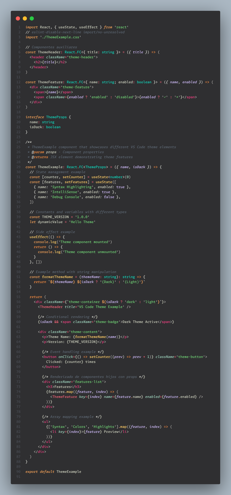

# VSCode SSXD Theme

A Visual Studio Code theme inspired by the beautiful Ayu color scheme.

## Features

- Carefully selected colors from the Ayu palette
- Three variants: Light, Mirage, and Dark
- Optimized for readability and long coding sessions
- Consistent highlighting across multiple languages

## Installation

1. Open VSCode
2. Go to Extensions (Ctrl+Shift+X)
3. Search for "SSXD Theme"
4. Click Install
5. Press Ctrl+K Ctrl+T to open the theme selector
6. Select your preferred Ayu variant

## Example

## Contributing

Feel free to contribute to this theme by opening issues or submitting pull requests on GitHub.

## License

MIT License